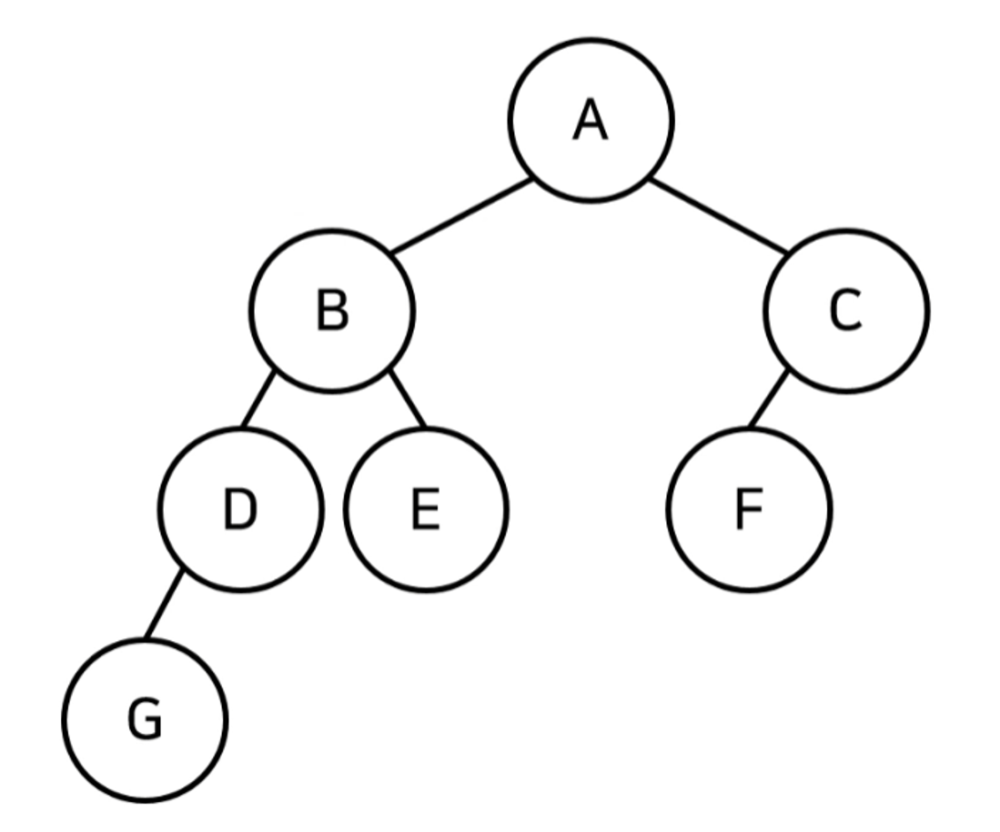

# Stack에 대하여
- [] 형태의 리스트로 `.append`/`.pop`의 형태로 가장 오른쪽에 들어온 것을 넣고 다시 뺀다.
- 다시 말하자면 가장 최근에 들어온 순으로 삭제가 된다.

# 큐 자료구조
- 먼저 들어온 데이터가 먼저 나가는 선입선출의 자료 구조.
- 대기 번호 순서대로 실행되는 것과 마찬가지이다.
- 양쪽으로 뚫린 구조라고 생각하면 된다.
- in -> 7 3 2 5 ->out
- 위의 예시에서 5부터 차례대로 들어가서 마지막에 7이 들어간 것.
- 그리고 순서대로 다시 5부터 나가게 된다.

## 우선순위 큐(Priority Queue)
- 우선순위 큐는 우선순위가 가장 높은 데이터를 가장 먼저 삭제하는 자료 구조.
- 우선순위 큐는 데이터를 우선순위에 따라 처리하고 싶을 때 사용.
    - 예시: 물건 데이터를 자료구조에 넣었다가 가치가 높은 물건부터 꺼내서 확인해야 하는 경우
- 이를 구현하는 법은 크게 두가지.
    1. 리스트를 이용하여 구현
    2. 힙(heap)을 이용하여 구현
- 데이터의 개수가 N개일 때 시간 복잡도
    - 리스트: 삽입 시간 & 삭제시간: O(l)
    - 힙(Heap): 삽입시간 & 삭제시간: O(logN)
- 단순히 N개의 데이터를 힙에 넣었다가 모두 꺼내는 작업은 정렬과 동일.

### 힙(Heap)의 특징

- 힙은 완전 이진 트리 자료구조의 일종.
- 힙에서는 항상 **루트 노드(root node)**를 제거
- **최소 힙(min heap)**
    - 루트 노드가 가장 작은 값
    - 값이 자은 데이터가 우선적으로 제거됨.
- **최대 힙(max heap)**
    - 루트 노드가 가장 큰 값을 가짐.
    - 따라서 값이 큰 데이터가 우선적으로 제거됨.

### 완전 이진 트리(Complete Binary Tree)
- **완전 이진 트리**란 루트(root) 노드부터 시작하여 왼쪽 자식 노드, 오른쪽 자식 노드 순서대로 데이터가 차례대로 삽입되는 트리(tree).

### 최소 힙 구성 함수: Min-Heapify()
- (상향식) 부모 노드로 거슬러 올라가며, 부모보다 자신의 값이 더 작은 경우에 위치를 교체.

### 힙에 새로운 원소가 삽입될 때
- 새로운 원소가 삽입되었을 때 O(logN)의 시간 복잡도로 힙 성질을 유지하도록 할 수 있음.

### 힙에서 원소가 제거될 때
- 원소가 제거되었을 때 O(logN)의 시간 복잡도로 힙 성질을 유지하도록 할 수 있음.
    - 이후에 루트 노드에서부터 하향식으로(더 작은 자식 노드로) Heapify() 진행.

## 트리(Tree)

- 트리는 가계도와 같은 계층적인 구조를 표현할 때 사용할 수 있는 자료 구조.
    - 루트 노드(root node): 부모가 없는 최상위 노드- 여기서는 A
    - 단말 노드(leaf node): 자식이 없는 노드- E, F, G
    - 크기(size):  트리에 포함된 모든 노드의 개수- 7개
    - 깊이(depth): 루트 노드로부터의 거리
    - 높이(height): 깊이 중 최댓값- 3
    - 차수(degree): 각 노드의 (자식방향) 간선 갯수- A는 2, B는 2, C는 1
- 기본적으로 트리의 크기가 N일 때, 전체 간선의 개수는 N-1

## 이진 탐색 트리 (Binary Search Tree)
- 이진 탐색이 동작할 수 있도록 고안된 효율적인 탐색이 가능한 자료구조.
- 이진 탐색 트리의 특징: 왼쪽 자식 노드 < 부모 노드 < 오른쪽 자식 노드
    - 부모 노드보다 왼쪽 자식 노드가 작다.
    - 부모 노드보다 오른쪽 자식 노드가 크다.
- 루트 노드부터 방문하여 이 숫자가 찾는 원소보다 큰지 작은지 본다.
- 찾는 원소가 더 크다면 오른쪽, 작다면 왼쪽으로 간다.

## 트리의 순회 (Tree Traversal)
- 트리 자료구조에 포함된 노드를 특정한 방법으로 한 번씩 방문하는 방법. (트리의 정보를 시각적으로 확인 가능)
- 전위 순회(pre-order traverse): 루트를 먼저 방문
- 중위 순회(in-order traverse): 왼쪽 자식을 방문한 뒤에 루트 방문
- 후위 순회(pose-order traverse): 오른쪽 자식을 방문한 뒤에 루트 방문
